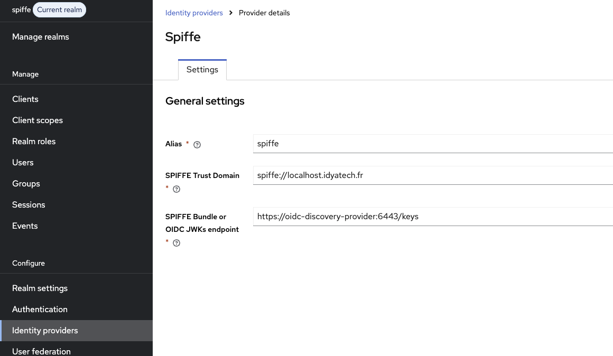

# Keycloak SPIFFE Dynamic Client Registration (DCR)

A Keycloak extension that enables **Dynamic Client Registration** using **JWT-SVID** as a software statement, allowing SPIFFE workloads to register themselves as OAuth2/OIDC clients without any pre-configuration or static secrets.

## Table of Contents

1. [Overview](#overview)
2. [Architecture](#architecture)
3. [How It Works](#how-it-works)
4. [Project Structure](#project-structure)
5. [JWT-SVID Validation](#jwt-svid-validation)
6. [Client Configuration](#client-configuration)
7. [Build & Installation](#build--installation)
8. [Usage](#usage)
9. [Integration with keycloak-spiffe POC](#integration-with-keycloak-spiffe-poc)
10. [Troubleshooting](#troubleshooting)
11. [Security Considerations](#security-considerations)

---

## Overview

Instead of pre-registering clients in Keycloak and managing static secrets, this extension allows SPIFFE workloads to **dynamically register themselves** by presenting a cryptographically signed **JWT-SVID** (SPIFFE Verifiable Identity Document) as proof of identity.

**Key Features:**
- ✅ Zero pre-configuration — clients register on-the-fly
- ✅ JWT-SVID signature verification against SPIFFE bundle endpoint
- ✅ SPIFFE ID extracted and stored as client metadata
- ✅ Client auto-configured with `federated-jwt` authenticator
- ✅ Service accounts enabled for `client_credentials` grant
- ✅ Default client scopes support (e.g. `mcp:resources`, `mcp:tools`, `mcp:prompts`)
- ✅ Duplicate client detection (409 Conflict)

---

## Architecture

```
┌─────────────┐         ┌────────────┐         ┌──────────────────────────────────┐
│  Workload   │         │SPIRE Agent │         │          Keycloak                │
│  (Go)       │         │            │         │                                  │
└──────┬──────┘         └─────┬──────┘         │  ┌────────────────────────────┐  │
       │                      │                │  │ SpiffeClientRegistration   │  │
       │ 1. FetchJWTSVID      │                │  │ Provider                   │  │
       ├─────────────────────▶│                │  │                            │  │
       │◀─────────────────────┤                │  │  ┌──────────────────────┐  │  │
       │    JWT-SVID          │                │  │  │  JwtSvidValidator    │  │  │
       │                      │                │  │  │                      │  │  │
       │ 2. POST /clients-registrations/       │  │  │ • Parse JWT          │  │  │
       │    spiffe-dcr/register                │  │  │ • Resolve IDP        │  │  │
       │    {software_statement: JWT-SVID}     │  │  │ • Verify Signature   │  │  │
       ├──────────────────────────────────────▶│  │  │ • Validate Claims    │  │  │
       │                      │                │  │  └──────────────────────┘  │  │
       │                      │                │  │                            │  │
       │                      │                │  │ → Extract SPIFFE ID        │  │
       │                      │                │  │ → Create Client            │  │
       │                      │                │  │ → Enable Service Account   │  │
       │◀──────────────────────────────────────│  └────────────────────────────┘  │
       │  201 Created + ClientRepresentation   │                                  │
       │                      │                │                                  │
       │ 3. POST /token       │                │                                  │
       │    grant_type=client_credentials      │                                  │
       │    client_assertion=<fresh JWT-SVID>  │                                  │
       ├──────────────────────────────────────▶│                                  │
       │◀──────────────────────────────────────│                                  │
       │  {access_token: ...}                  │                                  │
       │                      │                └──────────────────────────────────┘
```

---

## How It Works

### Complete Flow

1. **Workload** fetches a **JWT-SVID** from the SPIRE Agent (via the Workload API)
2. **Workload** sends a `POST` to the DCR endpoint with the JWT-SVID as `software_statement`
3. **Keycloak** receives the request and delegates to `SpiffeClientRegistrationProvider`
4. **JwtSvidValidator** validates the JWT-SVID:
   - Resolves the Identity Provider by alias to get the bundle endpoint URL
   - Fetches the JWKS public keys from the SPIFFE bundle endpoint
   - Verifies the JWT signature using the matching `kid`
   - Validates SPIFFE claims (`sub` starts with `spiffe://`, `iss` present)
   - Validates temporal claims (`exp`)
5. **Provider** extracts the SPIFFE ID from the `sub` claim and creates a new client:
   - Client ID derived from the last path segment of the SPIFFE ID
   - Authenticator set to `federated-jwt`
   - Service accounts enabled
   - SPIFFE metadata stored as client attributes
6. **Workload** can now authenticate using `client_credentials` grant with a fresh JWT-SVID

---

## Project Structure

```
keycloak-spiffe-dcr/
├── pom.xml                                    # Maven configuration (Keycloak 26.5.3, Java 17)
├── README.md                                  # This file
└── src/
    └── main/
        ├── java/org/idyatech/keycloak/spiffe/
        │   ├── SpiffeClientRegistrationProviderFactory.java   # SPI Factory (provider ID: spiffe-dcr)
        │   ├── SpiffeClientRegistrationProvider.java          # REST endpoint & client creation logic
        │   └── JwtSvidValidator.java                          # JWT-SVID parsing, signature & claims validation
        └── resources/
            └── META-INF/services/
                └── org.keycloak.services.clientregistration.ClientRegistrationProviderFactory
```

### Class Responsibilities

| Class | Role |
|-------|------|
| **`SpiffeClientRegistrationProviderFactory`** | Keycloak SPI factory. Registers the provider with ID `spiffe-dcr`. Creates `SpiffeClientRegistrationProvider` instances. |
| **`SpiffeClientRegistrationProvider`** | JAX-RS resource. Handles `POST /register`, orchestrates JWT-SVID validation → client creation → response. Extends `AbstractClientRegistrationProvider`. |
| **`JwtSvidValidator`** | Stateless validation logic. Parses JWT, resolves IDP, verifies signature via bundle endpoint JWKS, validates SPIFFE and temporal claims. |

---

## JWT-SVID Validation

The `JwtSvidValidator` performs 5 validation steps:

### 1. Identity Provider Resolution
Resolves the Keycloak Identity Provider by the `idp_alias` attribute from the request. 
The IDP configuration must contain a `bundleEndpoint` property pointing to the SPIFFE OIDC keys URL (e.g. `https://oidc-discovery-provider:6443/keys`).



### 2. Signature Verification
- Extracts `kid` and `alg` from the JWT header
- Fetches the matching public key from the SPIFFE bundle endpoint via `SpiffeBundleEndpointLoader`
- Uses Keycloak's `PublicKeyStorageProvider` for key caching
- Verifies the signature using Keycloak's `SignatureProvider`

### 3. Claims Deserialization
Deserializes the JWT payload into Keycloak's `JsonWebToken` using `JsonSerialization`.

### 4. SPIFFE Claims Validation
- `sub` (subject) must start with `spiffe://`
- `iss` (issuer) must be present

### 5. Temporal Claims Validation
- `exp` (expiration) must be in the future
---

## Client Configuration

When a client is registered, it is automatically configured with:

| Property | Value | Description |
|----------|-------|-------------|
| `clientId` | Last segment of SPIFFE ID | e.g. `spiffe://example.org/mcp-client` → `mcp-client` |
| `name` | `SPIFFE Client: <clientId>` | Human-readable name |
| `clientAuthenticatorType` | `federated-jwt` | Uses JWT-SVID for authentication |
| `serviceAccountsEnabled` | `true` | Enables `client_credentials` grant |
| `publicClient` | `false` | Confidential client |

### Client Attributes

| Attribute | Value | Description |
|-----------|-------|-------------|
| `jwt.credential.sub` | Full SPIFFE ID | e.g. `spiffe://localhost.idyatech.fr/mcp-client` |
| `jwt.credential.issuer` | IDP alias | e.g. `spiffe` |
| `spiffe.audience` | JWT audience(s) | Comma-separated audience values |

### Default Client Scopes

The client can be registered with custom default scopes. The Go workload sends:

```json
{
  "defaultClientScopes": ["mcp:resources", "mcp:tools", "mcp:prompts"]
}
```

> **Note:** These scopes must exist in the Keycloak realm before the client is registered.

---

## Build & Installation

### Prerequisites

- Java 17+
- Maven 3.6+
- Keycloak 26.5.3

### Build

```bash
cd keycloak-spiffe-dcr
mvn clean package
```

This produces `target/keycloak-spiffe-dcr-1.0-SNAPSHOT.jar`.

### Installation

#### Option 1: Copy to Keycloak providers directory

```bash
cp target/keycloak-spiffe-dcr-1.0-SNAPSHOT.jar /opt/keycloak/providers/
/opt/keycloak/bin/kc.sh build
/opt/keycloak/bin/kc.sh start
```

#### Option 2: Mount via Docker Compose (used in keycloak-spiffe POC)

In `docker-compose.yml`, the JAR is mounted directly:

```yaml
keycloak:
  volumes:
    - ./../keycloak-spiffe-dcr/target/keycloak-spiffe-dcr-1.0-SNAPSHOT.jar:/opt/keycloak/providers/keycloak-spiffe-dcr-1.0-SNAPSHOT.jar:ro
```

---

## Usage

### DCR Endpoint

```
POST /auth/realms/{realm}/clients-registrations/spiffe-dcr/register
Content-Type: application/json
```

### Request Body

```json
{
  "description": "Client registered via SPIFFE DCR with JWT-SVID",
  "defaultClientScopes": ["mcp:resources", "mcp:tools", "mcp:prompts"],
  "attributes": {
    "software_statement": "<JWT-SVID>",
    "idp_alias": "spiffe"
  }
}
```

| Field | Required | Description |
|-------|----------|-------------|
| `attributes.software_statement` | **Yes** | The raw JWT-SVID string |
| `attributes.idp_alias` | **Yes** | Alias of the SPIFFE Identity Provider in Keycloak |
| `defaultClientScopes` | No | List of default client scopes to assign |
| `description` | No | Client description |

### Response

**201 Created:**

```json
{
  "id": "a1b2c3d4-...",
  "clientId": "mcp-client",
  "name": "SPIFFE Client: mcp-client",
  "clientAuthenticatorType": "federated-jwt",
  "serviceAccountsEnabled": true,
  "publicClient": false,
  "attributes": {
    "jwt.credential.sub": "spiffe://localhost.idyatech.fr/mcp-client",
    "jwt.credential.issuer": "spiffe",
    "spiffe.audience": "https://localhost.idyatech.fr:8443/auth/realms/spiffe"
  }
}
```

**409 Conflict:** Client already exists.

**401 Unauthorized:** Invalid JWT-SVID (bad signature, expired, invalid SPIFFE ID).

**400 Bad Request:** Missing `software_statement`.

### Example: curl

```bash
# 1. Get JWT-SVID from SPIRE Agent
JWT_SVID=$(docker exec spire-agent /opt/spire/bin/spire-agent api fetch jwt \
  -audience https://localhost.idyatech.fr:8443/auth/realms/spiffe \
  -socketPath /opt/spire/sockets/agent.sock -output json | jq -r '.[] | .svids[0].svid')

# 2. Register client
curl -k -X POST \
  https://localhost.idyatech.fr:8443/auth/realms/spiffe/clients-registrations/spiffe-dcr/register \
  -H "Content-Type: application/json" \
  -d "{
    \"defaultClientScopes\": [\"mcp:resources\", \"mcp:tools\", \"mcp:prompts\"],
    \"attributes\": {
      \"software_statement\": \"$JWT_SVID\",
      \"idp_alias\": \"spiffe\"
    }
  }"
```

### Example: Go Workload

The `workload/main.go` in the `keycloak-spiffe` POC demonstrates the full flow:

```go
// Step 1: Fetch JWT-SVID
source, _ := workloadapi.NewJWTSource(ctx, clientOptions)
svid, _ := source.FetchJWTSVID(ctx, jwtsvid.Params{Audience: audience})

// Step 2: Register client via DCR
reqBody := dcrRequest{
    DefaultClientScopes: []string{"mcp:resources", "mcp:tools", "mcp:prompts"},
    Attributes: map[string]string{
        "software_statement": svid.Marshal(),
        "idp_alias":         "spiffe",
    },
}
// POST to /clients-registrations/spiffe-dcr/register

// Step 3: Authenticate with fresh JWT-SVID
formData := url.Values{
    "grant_type":            {"client_credentials"},
    "client_assertion_type": {"urn:ietf:params:oauth:client-assertion-type:jwt-spiffe"},
    "client_assertion":      {freshSvid.Marshal()},
}
// POST to /protocol/openid-connect/token
```

---

## Integration with keycloak-spiffe POC

This extension integrates with the [keycloak-spiffe POC](../keycloak-spiffe/README.md):

### Docker Compose Configuration

In `keycloak-spiffe/docker-compose.yml`, the JAR is mounted into the Keycloak container:

```yaml
keycloak:
  image: quay.io/keycloak/keycloak:26.5.3
  command:
    - start
    - --features=spiffe,client-auth-federated
  volumes:
    - ./../keycloak-spiffe-dcr/target/keycloak-spiffe-dcr-1.0-SNAPSHOT.jar:/opt/keycloak/providers/keycloak-spiffe-dcr-1.0-SNAPSHOT.jar:ro
```

### Workload Environment Variables

| Variable | Default | Description |
|----------|---------|-------------|
| `KEYCLOAK_URL` | `https://keycloak:8443` | Keycloak base URL |
| `REALM` | `spiffe` | Keycloak realm |
| `AUDIENCE` | `{KEYCLOAK_URL}/auth/realms/{REALM}` | JWT-SVID audience |
| `IDP_ALIAS` | `spiffe` | SPIFFE Identity Provider alias in Keycloak |

### Prerequisites

Before running the workload, ensure:

1. **SPIRE Server** and **Agent** are running and healthy
2. The workload has a **registration entry** in SPIRE Server
3. **Keycloak** is running with the `spiffe` and `client-auth-federated` features enabled
4. The **SPIFFE Identity Provider** is configured in the realm with a `bundleEndpoint`
5. The required **client scopes** exist in the realm (e.g. `mcp:resources`, `mcp:tools`, `mcp:prompts`)

---

## Troubleshooting

### `software_statement is required` (400)

The `software_statement` attribute is missing from the request body.

```json
{
  "attributes": {
    "software_statement": "<JWT-SVID>"
  }
}
```

The `software_statement` field **must** be present in the `attributes` object.

### `Invalid JWT-SVID` (401)

Possible causes:
- **Expired JWT-SVID:** Check `exp` claim. Fetch a fresh one.
- **Invalid SPIFFE ID:** `sub` claim must start with `spiffe://`
- **Missing `iss` claim**
- **Signature verification failed:** Bundle endpoint may be unreachable or keys rotated.

**Debug:** Check Keycloak server logs for detailed error messages from `JwtSvidValidator`.

### `Client already exists` (409)

A client with the same `clientId` (derived from the SPIFFE ID) already exists.

**Solutions:**
- Delete the existing client in Keycloak Admin Console
- Or use a different SPIFFE ID

### `Token was issued too far in the past` (on token exchange)

The JWT-SVID used for `client_assertion` was issued too long ago.

**Solutions:**
- Add `"clientAssertionMaxLifespan": "300"` to the realm `attributes` in `spiffe-realm.json`
- Ensure the workload fetches a **fresh** JWT-SVID right before the token exchange

### `Identity provider not found for alias: ...`

The `idp_alias` attribute does not match any Identity Provider in the realm.

**Solution:** Verify the IDP exists in Keycloak Admin Console → Identity Providers, and that the alias matches.

### `No bundleEndpoint configured for identity provider: ...`

The Identity Provider is missing the `bundleEndpoint` configuration property.

**Solution:** In the IDP configuration, set the bundle endpoint URL (e.g. `https://oidc-discovery-provider:6443/keys`).

### `No public key found for kid=...`

The JWT-SVID `kid` header does not match any key from the bundle endpoint.

**Possible causes:**
- SPIRE Server keys were rotated
- OIDC Discovery Provider is not running or unreachable
- Bundle endpoint URL is incorrect

---

## Security Considerations

### Current Implementation

- ✅ Full cryptographic signature verification using SPIFFE bundle endpoint JWKS
- ✅ SPIFFE ID validation (must be a valid `spiffe://` URI)
- ✅ Temporal claims validation (exp, nbf)
- ✅ Duplicate client detection
- ✅ Temporary attributes (`software_statement`, `idp_alias`) cleaned up before persistence

### Production Recommendations

1. **Restrict SPIFFE trust domains** — Add a whitelist of allowed trust domains
2. **Rate limiting** — Prevent abuse of the registration endpoint
3. **Client registration policies** — Configure Keycloak client registration policies for the `spiffe-dcr` provider
4. **Audit logging** — Enable Keycloak event logging for all `CLIENT_REGISTER` events
5. **TLS everywhere** — Ensure the bundle endpoint uses valid TLS certificates
6. **Scope restrictions** — Only allow scopes that exist in the realm

---

## Dependencies

| Dependency | Version | Scope | Purpose |
|------------|---------|-------|---------|
| `keycloak-core` | 26.5.3 | compile | Core Keycloak classes |
| `keycloak-server-spi` | 26.5.3 | compile | SPI interfaces |
| `keycloak-server-spi-private` | 26.5.3 | compile | Private SPI classes |
| `keycloak-services` | 26.5.3 | compile | Client registration, managers |
| `keycloak-model-jpa` | 26.5.3 | compile | Model persistence |
| `jboss-logging` | 3.5.3 | provided | Logging (provided by Keycloak runtime) |

---

## Resources

- [Keycloak Client Registration](https://www.keycloak.org/docs/latest/securing_apps/#_client_registration)
- [SPIFFE/SPIRE](https://spiffe.io)
- [JWT-SVID Specification](https://github.com/spiffe/spiffe/blob/main/standards/JWT-SVID.md)
- [OAuth 2.0 DCR (RFC 7591)](https://tools.ietf.org/html/rfc7591)
- [keycloak-spiffe POC](../keycloak-spiffe/README.md)


