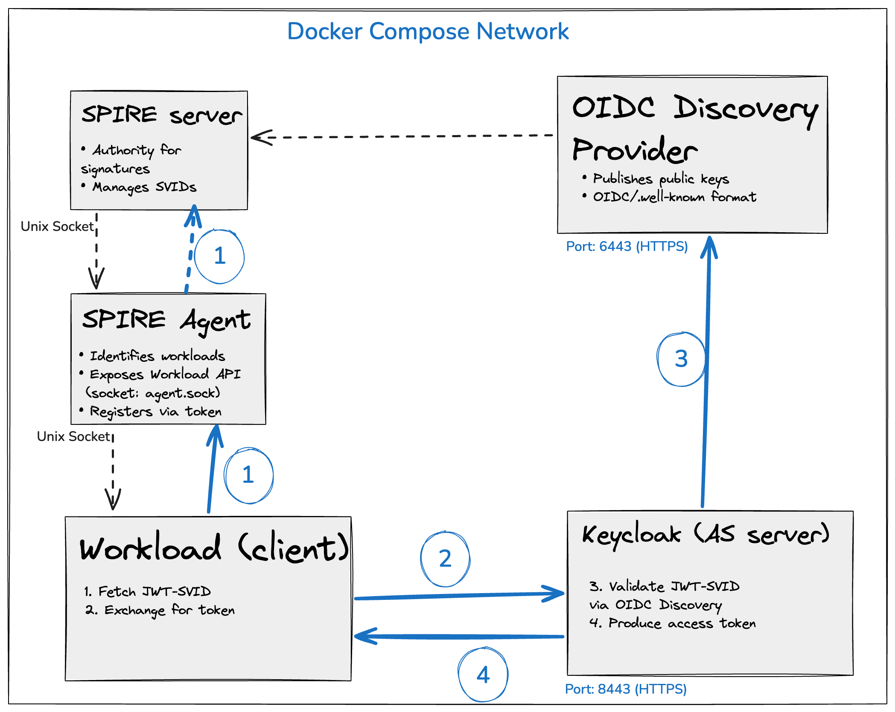
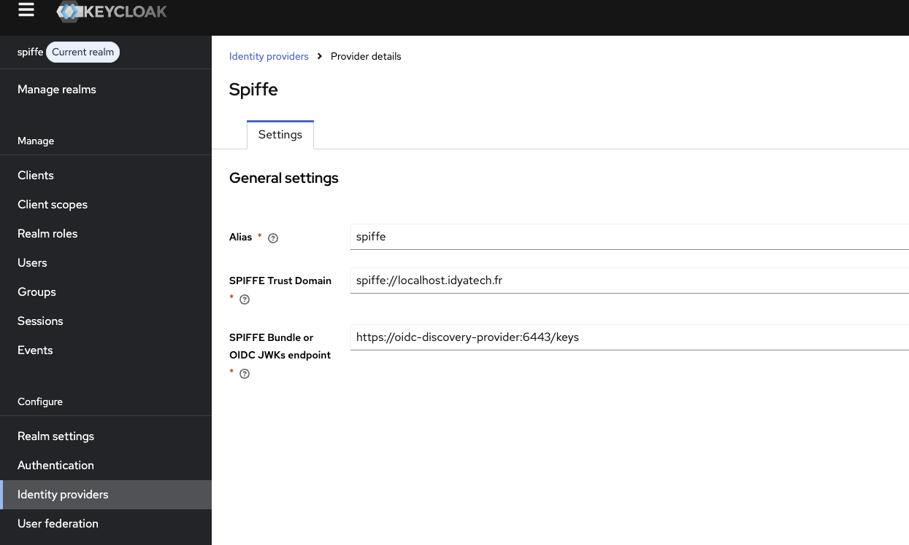
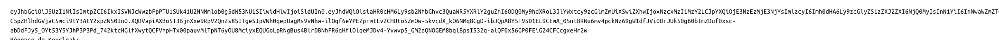
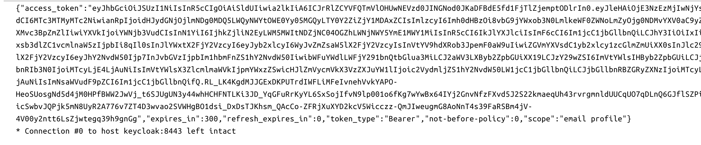

# Secret-less Authentication with Keycloak and SPIFFE/SPIRE

## Table of Contents

1. [Overview](#overview)
2. [Motivations and Challenges](#motivations-and-challenges)
3. [Key Concepts](#key-concepts)
4. [Detailed Architecture](#detailed-architecture)
5. [Authentication Flow](#authentication-flow)
6. [POC Components](#poc-components)
7. [Step-by-Step Guide](#step-by-step-guide)
8. [Exploration](#exploration)

---

## Overview

This POC demonstrates a **revolutionary** approach to application authentication without exposing static secrets. Instead of using `client_secret` (fixed and dangerous character strings), we leverage **SPIFFE/SPIRE** to dynamically generate a cryptographic proof of identity (a **JWT-SVID**) that the application presents to Keycloak.

**In Practice:**
- An application (`workload`) requests an identity from SPIRE Agent.
- SPIRE Agent returns a cryptographically signed **JWT-SVID**.
- The application sends this JWT-SVID to Keycloak.
- Keycloak validates the signature using the public keys from the SPIFFE OIDC provider.
- If valid, Keycloak issues a standard OAuth2 access token.

**Benefits:**
- ✅ No `client_secret` to manage, protect or rotate.
- ✅ Identity cryptographically tied to the application.
- ✅ Automatic revocation and rotation via SPIRE.
- ✅ Complete audit trail of identities used.

---

## Motivations and Challenges

### The Problem with Static Secrets

Traditionally, applications authenticate against SSO systems (like Keycloak) by presenting:
- A `client_id` (public identifier)
- A `client_secret` (secret key)

**Problems:**
1. **Complex Management:** Secrets must be stored, rotated, and distributed securely.
2. **Leak Risk:** A secret in a config file, log, or Git repo = compromise.
3. **No Granularity:** A single secret per application, even if it runs on multiple nodes.
4. **Limited Audit:** Hard to know which secret was used and when.

### The Solution: SPIFFE + JWT-SVID

**SPIFFE** (Secure Production Identity Framework For Everyone) proposes an open standard for attesting and certifying the identities of workloads (applications, services, containers).

**SPIRE** (the SPIFFE runtime environment) is the reference implementation that provides:
- **Node Attestation:** Proves that a machine/container is authorized.
- **Workload Attestation:** Proves that a specific application is running on this node.
- **SVID (SPIFFE Verifiable Identity Document):** A signed certificate or JWT that proves identity.

In this POC, we use **JWT-SVID**, a signed JWT format that applications can use to authenticate.

---

## Key Concepts

### SPIRE Server
The central SPIFFE authority. It maintains:
- A registry of agents (authorized nodes).
- A registry of workload registrations (rules for who can get which identity).
- Private keys to sign SVIDs.
- Bundles (public keys) to share with other systems.

### SPIRE Agent
Runs locally on each node (machine, container, pod). It:
- Authenticates to SPIRE Server via Node Attestation.
- Listens on a Unix socket (Workload API).
- Identifies processes (workloads) that request an identity.
- Retrieves SVIDs from the server and provides them to applications.

### JWT-SVID
A standard JWT (JSON Web Token) containing:
- `sub`: The SPIFFE identity (e.g., `spiffe://localhost.idyatech.fr/ns/default/sa/workload`).
- `aud`: The audience (who this JWT is intended for, e.g., Keycloak).
- `exp`: Expiration date (typically short, a few hours).
- Cryptographic signature from SPIRE Server.

### OIDC Discovery Provider
A service that publishes public SPIFFE information in OpenID Connect format:
- `/well-known/openid-configuration`: OIDC configuration.
- `/keys`: Public keys (JWKS) to validate JWT-SVIDs.

Keycloak uses this endpoint to validate received JWT-SVIDs.

---

## Detailed Architecture


---

## Authentication Flow

### Complete Sequence

```
┌─────────┐           ┌───────────┐          ┌──────────┐          ┌──────────────┐
│Workload │           │SPIRE Agent│          │SPIRE Srvr│          │   Keycloak   │
└────┬────┘           └─────┬─────┘          └────┬─────┘          └──────┬───────┘
     │                      │                     │                       │
     │ 1. Connect to API    │                     │                       │
     │ (socket)             │                     │                       │
     ├─────────────────────▶│                     │                       │
     │                      │                     │                       │
     │ 2. Request JWT-SVID  │                     │                       │
     │ (FetchJWTSVID)       │                     │                       │
     ├─────────────────────▶│                     │                       │
     │                      │ 3. Attest workload  │                       │
     │                      │ (socket + PID)      │                       │
     │                      ├────────────────────▶│                       │
     │                      │                     │ 4. Verify attestation │
     │                      │◀────────────────────┤ (check docker labels) │
     │                      │                     │                       │
     │                      │ 5. Fetch/sign SVID  │                       │
     │                      │ (from server cache) │                       │
     │                      │                     │                       │
     │◀─────────────────────┤ 6. Return JWT-SVID  │                       │
     │ (eyJhbGc...)         │                     │                       │
     │                      │                     │                       │
     │ 7. curl POST /token  │                     │                       │
     │    + client_assertion├────────────────────────────────────────────▶│
     │    + grant_type      │                     │                       │
     │                      │                     │ 8. Validate JWT-SVID  │
     │                      │                     │ • Check signature     │
     │                      │                     │ • Verify OIDC keys    │
     │                      │                     │ • Check audience      │
     │                      │                     │ • Check expiration    │
     │                      │                     │                       │
     │                      │                     │ 9. Generate token     │
     │◀───────────────────────────────────────────┤ (access_token)        │
     │ {access_token: ...}  │                     │ • Claims from SVID    │
     │                      │                     │ • TTL: 5 min (config) │
     │                      │                     │                       │
```

### Details of JWT-SVID Received

The JWT-SVID has this structure:

```json
{
  "alg": "RS256",
  "kid": "MS29dRCqab7j1MoU163kv5xI4iPl0HST",
  "typ": "JWT"
}.{
  "sub": "spiffe://localhost.idyatech.fr/mcp-client",
  "aud": ["https://localhost.idyatech.fr:8443/auth/realms/spiffe"],
  "exp": 1613444400,
  "iat": 1613443500,
  "jti": "6b...",
  "iss": "spiffe://localhost.idyatech.fr"
}.[SIGNATURE_RSA_256]
```

### Details of Keycloak Token Received

In return, Keycloak issues a standard OAuth2 token:

```json
{
  "access_token": "eyJhbGciOiJSUzI1NiIsInR5cCI6IkpXVCJ9...",
  "token_type": "Bearer",
  "expires_in": 300,
  "scope": "openid profile email"
}
```

---

## POC Components

### 1. SPIRE Server (`spire-server`)

**Image:** `ghcr.io/spiffe/spire-server:1.14.0`

**Responsibilities:**
- Issue and sign JWT-SVIDs.
- Maintain the registry of agents and workloads.
- Expose an API (Unix socket) for agents.

**Configuration:** `spire-server/server.conf`
- `bind_address`: API listen address.
- `datastore_type`: Database (SQLite for dev).
- `ca_subject`: Subject of the authority certificate.
- `default_ttl`: Default TTL for SVIDs.

**Healthcheck:**
```bash
/opt/spire/bin/spire-server healthcheck
```

### 2. SPIRE Agent (`spire-agent`)

**Image:** `ghcr.io/spiffe/spire-agent:1.14.0`

**Responsibilities:**
- Authenticate to SPIRE Server via Node Attestation using `join_token`.
- Identify workloads based on Docker labels and PID.
- Provide the Workload API to applications.

**Configuration:** `spire-agent/agent.conf`
- `bind_address`: Workload API address (Unix socket).
- `node_attestation`: How the node authenticates (join token, plugin, etc.).
- `workload_attestation`: How to identify workloads (Docker labels, binary path, etc.).

**Startup:**
```bash
spire-agent -config /path/to/agent.conf -joinToken <UUID>
```

The `joinToken` must be generated by the server and accepted by it.

### 3. OIDC Discovery Provider (`oidc-discovery-provider`)

**Image:** `ghcr.io/spiffe/oidc-discovery-provider:1.14.0`

**Responsibilities:**
- Publish public keys and OIDC configuration for SPIFFE.
- Expose the `/well-known/openid-configuration` endpoint used by Keycloak.

**Configuration:** `oidc-discovery-provider/oidc-discovery-provider.conf`
- `domains`: Domains for which to publish OIDC.
- `serving_cert_file`: TLS certificate (port 6443).
- `health_checks`: Health endpoints (port 8008).

**Endpoints:**
- `https://localhost.idyatech.fr:6443/.well-known/openid-configuration`
- `https://localhost.idyatech.fr:6443/keys`

### 4. Keycloak (`keycloak`)

**Image:** `quay.io/keycloak/keycloak:26.5.3`

**Responsibilities:**
- OAuth2/OIDC authority for applications.
- Validate JWT-SVIDs and issue access tokens.
- Manage the `spiffe` realm.

**Configuration (env + command):**
```yaml
KC_BOOTSTRAP_ADMIN_USERNAME: admin
KC_BOOTSTRAP_ADMIN_PASSWORD: admin
KC_HOSTNAME: localhost.idyatech.fr
KC_HTTP_ENABLED: true
KC_HTTP_RELATIVE_PATH: /auth
```

**Features Enabled:**
- `spiffe`: JWT-SVID support.
- `client-auth-federated`: Client authentication via external provider.

**Ports:**
- `8180`: HTTP
- `8443`: HTTPS
- `9000`: Health & metrics

**Imported Realm:** `keycloak/spiffe-realm.json`
- Contains an `mcp-client` client configured with:
  - `client_authenticator`: `spiffe-jwt-bearer`
  - Audience: `https://localhost.idyatech.fr:8443/auth/realms/spiffe`

### 5. Workload (Go Client) (`workload`)

**Source:** `workload/main.go`
**Dockerfile:** `workload/Dockerfile`

**Responsibilities:**
- Request a JWT-SVID from SPIRE Agent.
- Send the JWT-SVID to Keycloak to obtain a token.
- Log the entire flow.

**Main Code:**

1. **Connect to SPIRE Agent:**
   ```go
   source, err := workloadapi.NewJWTSource(ctx, clientOptions)
   ```

2. **Fetch the JWT-SVID:**
   ```go
   svid, err := source.FetchJWTSVID(ctx, jwtsvid.Params{
       Audience: audience,
   })
   ```

3. **Exchange with Keycloak (via curl):**
   ```bash
   curl -X POST \
     -d "grant_type=client_credentials" \
     -d "client_assertion_type=urn:ietf:params:oauth:client-assertion-type:jwt-spiffe" \
     -d "client_assertion=<JWT-SVID>" \
     https://keycloak:8443/auth/realms/spiffe/protocol/openid-connect/token
   ```

**Environment Variables:**
- `SPIFFE_ENDPOINT_SOCKET`: Path to the Workload API socket (`unix:///opt/spire/sockets/agent.sock`).
- `AUDIENCE`: JWT-SVID audience (must match Keycloak).

---

## Step-by-Step Guide

### Prerequisites

- **Docker** and **Docker Compose** (plugin v2) installed and functional.
- **Disk Space:** ~2 GB for images.
- **Available Ports:** 8180, 8443, 9000 (Keycloak), 6443, 8008 (ODP), Docker volumes.

### Step 1: Start the Environment

Open a terminal in the `keycloak-spiffe/` folder and run the following command to build images and start all containers in the background.

```bash
docker compose up -d --build
```

**What Happens:**
1. Docker builds the `workload` image (from `Dockerfile`).
2. All services start in the order defined by `depends_on`:
   - `spire-server` first.
   - `spire-agent` and `oidc-discovery-provider` once `spire-server` is healthy.
   - `workload` once `spire-agent` is ready.
3. The `workload` container runs immediately and performs the authentication flow.

### Step 1bis: Regenerate the Agent Token (if necessary)

> **⚠️ Important:** If the SPIRE agent does not register with the server, the token provided in `docker-compose.yml` may be expired, invalid, or already used.

**Symptoms:**
- The agent fails to connect with authentication error messages.
- The workload cannot retrieve a JWT-SVID.

**Solution:**

1. **Generate a new token from the SPIRE server:**
   ```bash
   docker exec -it spire-server /opt/spire/bin/spire-server token generate \
     -spiffeID spiffe://localhost.idyatech.fr/spire-agent
   ```

   You will receive a UUID like this:
   ```
   Token: <your-new-token-uuid>
   ```

2. **Copy this token and update `docker-compose.yml`:**

   Find the `spire-agent` service section and replace the existing `joinToken`:
   ```yaml
   spire-agent:
     # ...
     command: ["-config", "/opt/spire/conf/server/agent.conf", "-joinToken", "<your-new-token-uuid>"]
   ```

3. **Restart the agent service:**
   ```bash
   docker compose restart spire-agent
   ```

4. **Verify the logs to confirm registration:**
   ```bash
   docker compose logs spire-agent | grep -i "registration\|registered\|success"
   ```

If you see a successful registration message, you can continue to step 1ter.

### Step 1ter: Register the Workload in SPIRE Server

> **⚠️ Important:** After registering the agent, you must create a **workload entry** that authorizes the `workload` container to obtain a SPIFFE identity.

**What We Do:**
- Create an entry (`entry create`) that tells SPIRE: "The process running in the Docker container labeled `com.docker.compose.service:workload` is authorized to obtain the identity `spiffe://localhost.idyatech.fr/mcp-client`".

**Command:**
```bash
docker exec -it spire-server /opt/spire/bin/spire-server entry create \
  -spiffeID spiffe://localhost.idyatech.fr/mcp-client \
  -parentID spiffe://localhost.idyatech.fr/spire/agent/join_token/f7b4da98-6e04-40cb-b562-96a59b8b3701 \
  -selector docker:label:com.docker.compose.service:workload
```

**⚠️ Critical Attention on `parentID`:**

The `parentID` **must match exactly the identity of the SPIRE agent** you registered.

- By default, it is: `spiffe://localhost.idyatech.fr/spire/agent/join_token/f7b4da98-6e04-40cb-b562-96a59b8b3701`
- **If you regenerated a new token** in step 1bis, you must **replace the UUID at the end** with the one you generated.

**How to Find the Correct `parentID`:**

If you're unsure, run this command to list all registered agents:
```bash
docker exec -it spire-server /opt/spire/bin/spire-server agent list
```

You will see output like:
```
SPIFFE ID                                                           Last Seen
...
spiffe://localhost.idyatech.fr/spire/agent/join_token/<UUID>      <timestamp>
```

Copy the complete UUID and use it in the `entry create` command.

**Execute the Command (adapted with the correct UUID):**
```bash
docker exec -it spire-server /opt/spire/bin/spire-server entry create \
  -spiffeID spiffe://localhost.idyatech.fr/mcp-client \
  -parentID spiffe://localhost.idyatech.fr/spire/agent/join_token/<UUID-CORRECT> \
  -selector docker:label:com.docker.compose.service:workload
```

You should see a confirmation:
```
Entry created successfully!
Entry ID: <entry-id>
```

**Restart the Workload:**

After creating the entry, restart the workload container to use the new identity:
```bash
docker compose restart workload
```

**Verify the Logs:**
```bash
docker compose logs workload
```

You should see in the logs:
1. ✅ `JWT-SVID obtained successfully!` → Identity obtained.
2. ✅ `Keycloak Response:` with an `access_token` → Token successfully issued.

If you see these messages, **the workload is now correctly authenticated** and you can proceed to step 2!

### Step 2: Verify that Services are Healthy

It is crucial to ensure that each component is operational before proceeding.

1.  **Check Container Status:**
    ```bash
    docker compose ps
    ```
    All services should have the status `running (healthy)`.

    **Example of Healthy Output:**
    ```
    NAME                        STATUS
    spire-server                running (healthy)
    spire-agent                 running (healthy)
    oidc-discovery-provider     running (healthy)
    keycloak                    running (healthy)
    workload                    exited with code 0
    ```

2.  **Consult Logs (if needed):**
    To follow startup or diagnose issues, use:
    ```bash
    docker compose logs -f
    ```
    To see logs from a specific service (e.g., `workload`):
    ```bash
    docker compose logs -f workload
    ```

3.  **Test Health Endpoints:**
    - **Keycloak:** Open [http://localhost:9000/auth/health/ready](http://localhost:9000/auth/health/ready) in your browser. You should see `UP` status.
    - **OIDC Discovery Provider:** Open [http://localhost:8008/ready](http://localhost:8008/ready) in your browser. You should see `OK`.

    **Manually Check SPIFFE Public Keys:**
    ```bash
    curl -k https://localhost.idyatech.fr:6443/keys
    ```
    You should get JSON with `keys` containing RSA public keys.

### Step 3: Observe the Authentication Flow

The `workload` container is the one executing the secret-less authentication flow. Its logs show us exactly what happens.

1.  **Display Workload Logs:**
    ```bash
    docker compose logs workload
    ```

2.  **Analyze the Output:** You should see in order:

    a. **JWT-SVID Received:**
    ```
    JWT-SVID obtained successfully!

    eyJhbGciOiJSUzI1NiIsImtpZCI6Ijcz...
    ```

    b. **curl Command Executed:**
    ```
    > POST /auth/realms/spiffe/protocol/openid-connect/token HTTP/1.1
    > Host: keycloak:8443
    > Content-Type: application/x-www-form-urlencoded
    > ...
    > grant_type=client_credentials&client_assertion_type=urn:ietf:params:oauth:client-assertion-type:jwt-spiffe&client_assertion=eyJhbGc...
    ```

    c. **Keycloak Response:**
    ```json
    {
      "access_token": "eyJhbGciOiJSUzI1NiIsInR5cCI6IkpXVCJ9...",
      "token_type": "Bearer",
      "expires_in": 300,
      "scope": "openid profile email"
    }
    ```

    **Congratulations, you just saw a Keycloak token issued without any static secret!**

3.  **Decode the Token (optional):**
    Go to [https://jwt.io](https://jwt.io) and paste the `access_token` to see its content.

### Step 4: Cleanup

To stop and remove all containers, networks, and volumes associated with this POC, run:

```bash
docker compose down -v
```

To keep volumes (e.g., Keycloak data), omit `-v`:
```bash
docker compose down
```

---

## Exploration and Troubleshooting

### Key Components and Their Configuration

- **`docker-compose.yml`**: Orchestrates all services. Note how the `spire-agent` gets a `joinToken` to register with the `spire-server`.
- **`workload/main.go`**: The client source code. It uses the `go-spiffe` library to obtain the JWT-SVID, then `curl` to exchange it.
- **`keycloak/spiffe-realm.json`**: Keycloak realm configuration. The `mcp-client` client is configured to use `JWT-SVID` as the authentication method.
- **`AUDIENCE`**: This environment variable, defined in `docker-compose.yml` for the `workload` service, is crucial. It must match the audience that Keycloak expects, otherwise the token exchange will fail.

### Common Problems and Solutions

#### Problem 1: The `workload` Container Stops Immediately

**Symptoms:**
```
workload exited with code 1
```

**Diagnosis:**
```bash
docker compose logs workload
```

Look for messages like:
- `Unable to connect to SPIRE: ...` → SPIRE Agent is not ready.
- `Error retrieving JWT-SVID: ...` → Workload authentication issue or **missing workload entry in SPIRE**.

**Solutions:**

1. **Verify that `spire-agent` is healthy:**
   ```bash
   docker compose ps spire-agent
   ```

2. **Check the `spire-agent` logs:**
   ```bash
   docker compose logs spire-agent
   ```

3. **Verify that the workload entry exists in SPIRE:**
   ```bash
   docker exec -it spire-server /opt/spire/bin/spire-server entry list
   ```

   You should see an entry with `spiffeID: spiffe://localhost.idyatech.fr/mcp-client`.

   If it doesn't exist, create it by following **[Step 1ter: Register the Workload in SPIRE Server](#step-1ter-register-the-workload-in-spire-server)**.

4. **Restart the `workload`:**
   ```bash
   docker compose restart workload
   ```

#### Problem 2: `curl: not found` Error in Workload Logs

**Symptoms:**
```
Error calling Keycloak: sh: curl: not found
```

**Cause:**
The `workload` Docker image (defined in `workload/Dockerfile`) doesn't have `curl` installed.

**Solution:**
Verify that the `Dockerfile` includes:
```dockerfile
RUN apt-get update && apt-get install -y curl
```
or equivalent for Alpine/Busybox.

#### Problem 3: TLS Certificate Error in curl Logs

**Symptoms:**
```
curl: (60) SSL certificate problem: self signed certificate
```

**Cause:**
Keycloak's certificate is self-signed. The `curl` in `main.go` uses `-k` to ignore validation, but there may be other issues (e.g., wrong certificate CN).

**Solution:**
The code already uses `-k`. If you remove it, you must trust the certificate:
```bash
curl --cacert /path/to/keycloak-cert.pem ...
```

#### Problem 4: SPIRE Agent Cannot Connect to SPIRE Server

**Symptoms:**
```
spire-agent: "dial unix ... api.sock: no such file or directory"
```

or in agent logs:
```
level=error msg="Failed to attest node" error="rpc error: code = Unauthenticated desc = invalid join token"
```

**Cause:**
There are two possible causes:
1. The `spire-server-sockets` volume is not mounted correctly or `spire-server` hasn't created the socket.
2. The `joinToken` in `docker-compose.yml` is expired or invalid.

**Solution:**

**Case 1: Check sockets**
1. Verify that `spire-server` is really healthy:
   ```bash
   docker compose logs spire-server
   ```
2. Verify the volumes:
   ```bash
   docker compose exec spire-server ls -la /tmp/spire-server/private/
   ```

**Case 2: Regenerate the token (most common)**

If you see an `invalid join token` message or similar, the token is expired. Follow **[Step 1bis: Regenerate the Agent Token](#step-1bis-regenerate-the-agent-token-if-necessary)** to generate a new token and restart the agent.

#### Problem 5: The Workload Entry Has an Incorrect `parentID`

**Symptoms:**
```
docker compose logs workload
# Displays: Error retrieving JWT-SVID
```

or after `entry list` you see:
```
spiffe://localhost.idyatech.fr/mcp-client  spiffe://localhost.idyatech.fr/spire/agent/join_token/<OLD-UUID>
```

But your agent is registered with a different UUID.

**Cause:**
You regenerated the agent token (Step 1bis), but the workload entry created still points to the old UUID.

**Solution:**

1. **List current agents:**
   ```bash
   docker exec -it spire-server /opt/spire/bin/spire-server agent list
   ```

   Note the new UUID.

2. **Delete the old entry:**
   ```bash
   docker exec -it spire-server /opt/spire/bin/spire-server entry list
   ```

   Find the Entry ID of the `mcp-client` entry and delete it:
   ```bash
   docker exec -it spire-server /opt/spire/bin/spire-server entry delete -entryID <ENTRY-ID>
   ```

3. **Create a new entry with the correct `parentID`:**
   ```bash
   docker exec -it spire-server /opt/spire/bin/spire-server entry create \
     -spiffeID spiffe://localhost.idyatech.fr/mcp-client \
     -parentID spiffe://localhost.idyatech.fr/spire/agent/join_token/<NEW-UUID> \
     -selector docker:label:com.docker.compose.service:workload
   ```

4. **Restart the workload:**
   ```bash
   docker compose restart workload
   ```

#### Problem 6: Keycloak Takes Too Long to Start

**Symptoms:**
Keycloak healthcheck fails after several attempts.

**Cause:**
Keycloak can take 30-60 seconds to start, especially on first run.

**Solution:**
Increase `start_period` and `retries` in the healthcheck in `docker-compose.yml`:
```yaml
healthcheck:
  test: [...]
  interval: 10s
  timeout: 5s
  retries: 10         # Increase here
  start_period: 60s   # And here
```

### Important Environment Variables

| Variable | Service                 | Description |
|----------|-------------------------|------------|
| `SPIFFE_ENDPOINT_SOCKET` | `workload`              | Path to the Workload API socket |
| `AUDIENCE` | `workload`              | JWT-SVID audience (must match Keycloak) |
| `KC_BOOTSTRAP_ADMIN_USERNAME` | `admin`                 | Initial admin user |
| `KC_BOOTSTRAP_ADMIN_PASSWORD` | `admin`                 | Initial admin password |
| `KC_HOSTNAME` | `localhost.idyatech.fr` | Hostname |

### Useful Endpoints for Debugging

| Service | Endpoint | Utility |
|---------|----------|---------|
| Keycloak | `http://localhost:9000/auth/health/ready` | Check health |
| Keycloak Admin | `https://localhost.idyatech.fr:8443/auth/admin` | Keycloak UI |
| ODP | `http://localhost:8008/ready` | Check health |
| ODP OIDC | `https://localhost.idyatech.fr:6443/.well-known/openid-configuration` | OIDC Configuration |
| ODP Keys | `https://localhost.idyatech.fr:6443/keys` | SPIFFE Public Keys |

---

## Resources

- **SPIFFE/SPIRE:** https://spiffe.io, https://github.com/spiffe/spire
- **Keycloak:** https://www.keycloak.org
- **OIDC:** https://openid.net/connect/
- **JWT:** https://jwt.io

## Appendix:

### Useful Commands to Generate RSA Key Pairs for OIDC Discovery Provider

```bash
openssl ecparam -name prime256v1 -genkey -noout -out oidc-dp-key.pem
openssl req -new -x509 -key oidc-dp-key.pem -out oidc-dp-cert.pem -days 365 \
  -subj "/CN=localhost" \
  -addext "subjectAltName=DNS:oidc-discovery-provider"
```

### Keycloak Configuration for SPIFFE IDP
The IDP configuration is already done in the imported realm, but here's what it looks like if you want to do it manually:


### Configuration of the mcp-client Client to Use SPIFFE IDP


### Preview of Workload Logs
    #### JWT-SVID


    #### Keycloak Response


